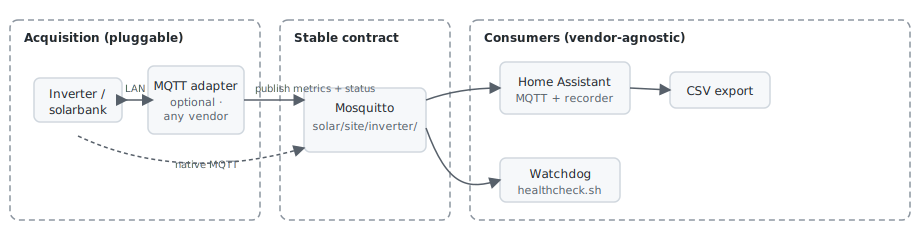
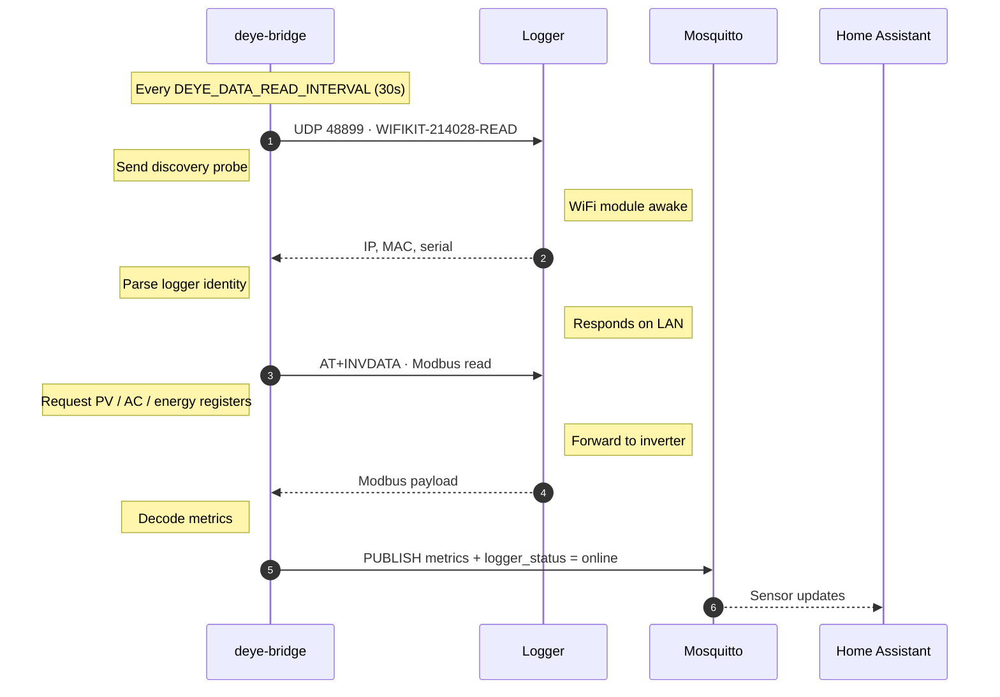
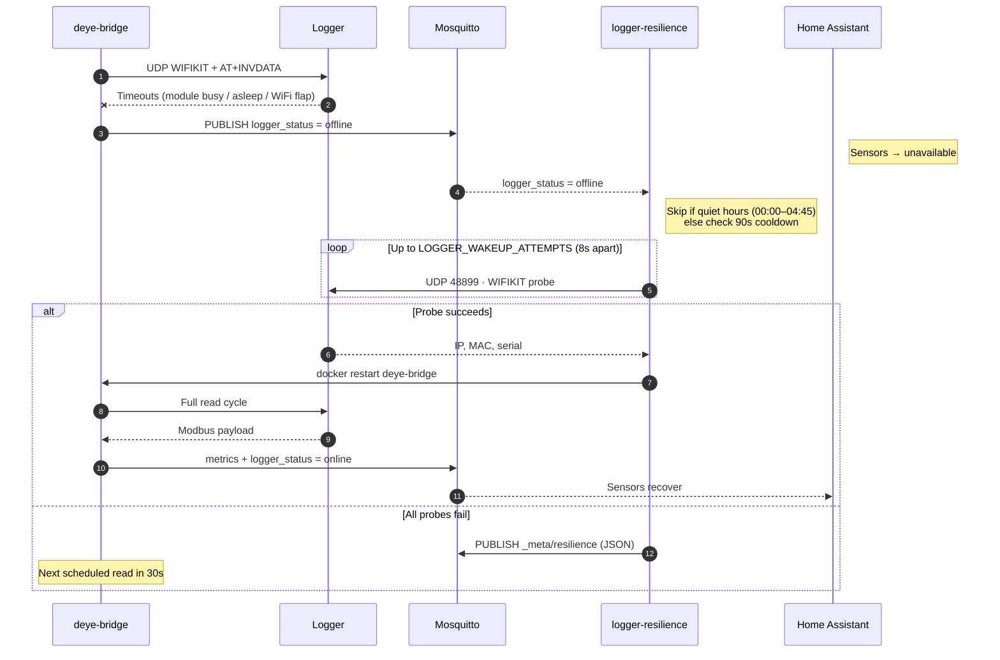

<div align="center">

[](https://henba1.github.io/bkw_tracker/)

</div>

# Solar Inverter Monitoring (MQTT)

<p align="center">
  <a href="https://henba1.github.io/bkw_tracker/">
    
  </a>
</p>

<p align="center">
  
</p>

Monitors **any inverter or solarbank that exposes live data over MQTT**, surfaces it in **Home Assistant** with dashboards and CSV export, and runs on a small always-on Linux host with Docker (e.g. Raspberry Pi).

A **bundled Deye adapter** is included and tested on SUN300G3; you can also point the stack at metrics your hardware already publishes.

### What Your Inverter Must Provide

For dashboards, Energy Dashboard, and computed daily energy to work, your hardware (or its MQTT bridge) needs to meet these **minimum** requirements:

| Requirement | Detail |
|---|---|
| **Protocol** | **MQTT v3.1.1+** with username/password (default port **1883**) |
| **Topic prefix** | `solar/<site>/<inverter_id>/` — or set `MQTT_TOPIC_PREFIX` in `stack.env` to match your layout |
| **Topic profile** | Suffixes match **`MQTT_TOPIC_PROFILE`** (`canonical` or `deye`) — see [Connecting your inverter](#connecting-your-inverter) |
| **Minimum metrics** | **AC power (W)** and **lifetime energy (kWh, monotonic)** |
| **Payloads** | Numbers as plain decimals; status as **`online`** / **`offline`** |
| **Update rate** | Live power at least every **~120 s** |

Recommended: PV power, grid voltage/frequency, temperature, device availability. LAN access is only required when using a bundled adapter that polls the device — **native MQTT publishers can run anywhere that reaches the broker**.

---

## Features

### Data acquisition (MQTT, typically ~30 s)

Published under `solar/{site}/{inverter_id}/` (default `solar/home/sun300g3`). Topic **suffixes** depend on `MQTT_TOPIC_PROFILE` in `stack.env` — see [Connecting your inverter](#connecting-your-inverter).

| Stream | Canonical suffix | Deye adapter suffix |
|---|---|---|
| AC output power | `ac/power_w` | `ac/active_power` |
| PV / DC power | `pv/power_w` | `dc/pv1/power` |
| Energy today | `energy/today_kwh` | `day_energy` |
| Lifetime energy | `energy/total_kwh` | `total_energy` |
| Grid voltage | `ac/voltage_v` | `ac/l1/voltage` |
| Grid frequency | `ac/frequency_hz` | `ac/freq` |
| Temperature | `device/temperature_c` | `radiator_temp` |
| Bridge online (LWT) | `_meta/availability` | `status` |
| Device online | `_meta/availability` | `logger_status` |

Authenticated **Mosquitto** broker. Acquisition is pluggable: bundled bridge or your own MQTT publisher.

### Home Assistant

- MQTT sensors with correct `device_class` / `state_class` (Energy Dashboard–ready)
- Device grouping under one inverter device
- `unavailable` when the device drops (status topic + 120 s `expire_after`)
- One-command install into an existing `homeassistant` Docker container
- **Solar** Lovelace dashboard: live gauge, entity cards, 48 h power history, 30-day daily energy bars, 7-day power statistics
- **Computed daily energy** from lifetime total (03:00 baseline) when inverter “today” counters are unreliable
- **Energy Dashboard** support via lifetime energy sensor (`total_increasing`)

### Export & history

- **CSV export** button — dumps all recorder time-series for solar entities to `/config/exports/`
- **Open History** — HA history view for all solar streams
- Long-term statistics via HA recorder (graphs on the dashboard)

### Operations

- Interactive `./setup.sh` wizard (`stack.env` IaC)
- `./scripts/stack.sh` — render configs, up/down, verify broker & metrics
- Optional **watchdog cron** — restarts acquisition if MQTT goes silent during daylight
- **Logger resilience** — spaced LAN wakeup probes when `logger_status=offline` (skipped 00:00–04:45 local by default)
- `./scripts/stack.sh probe` — manual LAN reachability check
- Docker `restart: unless-stopped` on broker and optional adapter

### Optional diagnostics (git clone / dev)

- `uv` + `pysolarmanv5` — network scan, Solarman smoke read (Deye discovery; not in release tarball)

---

## Prerequisites

| Requirement | Details |
|---|---|
| **Host** | Linux with Docker and Docker Compose v2 |
| **Python** (optional) | 3.11+ with [uv](https://docs.astral.sh/uv/) — discovery/smoke tools only |
| **Network** | Host on the same LAN as the inverter (for bundled adapters) |
| **MQTT** | Inverter or bridge must publish metrics the stack can subscribe to (see below) |
| **Home Assistant** | Optional but this repo targets it — see below |

### Home Assistant

Works with an **existing Home Assistant Docker container** (recommended on the same Pi):

- Container name defaults to `homeassistant` (`HA_CONTAINER` in `stack.env`)
- Config path is auto-detected from the container’s `/config` mount
- If HA uses **host networking** on the same machine as Mosquitto → broker is `127.0.0.1:1883` (default)
- If HA runs elsewhere → set `HA_CONFIG` to its config directory and `MQTT_BROKER_HOST` to this Pi’s LAN IP

This project runs **Mosquitto** (+ optional acquisition adapter). It does not install Home Assistant.

---

## Connecting Your Inverter

The stack is **vendor-agnostic at the MQTT layer**. Pick one path:

### Path 1 — Your device already publishes MQTT (plug-and-play)

**Requirements:** MQTT v3.1.1+, username/password, metrics under `solar/<site>/<id>/` using the **canonical** suffixes (table above), AC power + lifetime energy at least every ~120 s.

1. Copy `stack.env.example` → `stack.env` and set:
   - `ACQUISITION_ADAPTER=external`
   - `MQTT_TOPIC_PROFILE=canonical`
   - `SITE_ID`, `INVERTER_ID`, `MQTT_PASSWORD`
   - `HA_INVERTER_MANUFACTURER`, `HA_INVERTER_MODEL` (labels in HA)
2. `./scripts/stack.sh init` (creates broker password file)
3. `./scripts/stack.sh up mosquitto`
4. Point your publisher at this broker (`MQTT_USER` / `MQTT_PASSWORD`, host IP, port `1883`)
5. `./scripts/stack.sh verify-metrics`
6. `./scripts/install_ha_package.sh --restart`

### Path 2 — Bundled Deye adapter (included, tested on SUN300G3)

Use when the inverter is polled on LAN via `deye-inverter-mqtt` (no native MQTT from the unit).

1. `./setup.sh` — wizard writes `stack.env` (defaults: `ACQUISITION_ADAPTER=deye`, `MQTT_TOPIC_PROFILE=deye`)
2. Set **logger IP** (router DHCP list; static lease recommended) and **serial** (10-digit sticker)
3. `LOGGER_PROTOCOL` / `LOGGER_PORT` — example defaults for SUN300G3: `at` / `48899`
4. `./scripts/stack.sh up`
5. `./scripts/stack.sh verify-metrics` (needs daylight + logger online)
6. `./scripts/install_ha_package.sh --restart`

### Path 3 — Another vendor’s MQTT bridge

Replace or supplement `deye-bridge` in `compose.yml` with that vendor’s container. Publish under the same prefix using **canonical** topics (or add a topic profile under `config/topic_profiles/`). Set `ACQUISITION_ADAPTER=external` if you do not use `deye-bridge`.

| Change | Effort |
|---|---|
| **External MQTT / canonical topics** | `stack.env` only → broker + HA install |
| **Another Deye model** | `stack.env` (`LOGGER_*`, `HA_INVERTER_*`, `DEYE_METRIC_GROUPS`) → render + up |
| **Different brand** | Vendor bridge + `MQTT_TOPIC_PROFILE` + optional `compose.yml` service swap |

---

## Quick start (bundled Deye adapter)

```bash
./setup.sh
```

The wizard asks for an MQTT password, inverter IP (skippable), and logger serial. It writes `stack.env`, starts Mosquitto, and optionally starts data collection.

```bash
./scripts/stack.sh up
./scripts/stack.sh verify-metrics
```

---

## Home Assistant

```bash
./scripts/install_ha_package.sh --restart
```

Entity IDs are derived from `HA_INVERTER_MANUFACTURER` and `HA_INVERTER_MODEL` (override with `HA_ENTITY_SLUG` in `stack.env`). Example for default Deye metadata:

- **Energy Dashboard (lifetime):** `sensor.deye_sun300g3_eu_230_solar_total_energy`
- **Today (computed):** `sensor.solar_today_energy_computed`

Sidebar **Solar** dashboard: live power, daily energy, history graphs, **Export all solar data** (CSV).

---

## Commands

| Task | Command |
|---|---|
| Start stack | `./scripts/stack.sh up` |
| Broker only | `./scripts/stack.sh up mosquitto` |
| Stop stack | `./scripts/stack.sh down` |
| Service status | `./scripts/stack.sh ps` |
| Live MQTT traffic | `./scripts/stack.sh verify-broker` |
| Check metrics | `./scripts/stack.sh verify-metrics` |
| Logger LAN probe | `./scripts/stack.sh probe` |
| Resilience logs | `./scripts/stack.sh logs logger-resilience` |
| Install / update HA | `./scripts/install_ha_package.sh --restart` |
| Watchdog cron (optional) | `./scripts/install_healthcheck_cron.sh` |

Manual config: copy `stack.env.example` → `stack.env`, then `./scripts/stack.sh init`.

---

## Communication and fault resistance

The bundled **deye-bridge** polls the inverter logger on your LAN (UDP **48899** + AT/Modbus) every **`DEYE_DATA_READ_INTERVAL`** seconds (default **30 s**) and publishes metrics to Mosquitto. **logger-resilience** watches `logger_status` and attempts recovery when reads fail.

| Component | Role |
|---|---|
| **deye-bridge** | Scheduled LAN read → MQTT publish |
| **logger-resilience** | Reacts to `logger_status=offline` with spaced UDP wakeup probes; restarts the bridge on success |
| **healthcheck cron** | Daylight-only watchdog; probes LAN before restarting a silent bridge |

Set `LOGGER_RESILIENCE_DAYLIGHT_ONLY=true` in `stack.env` (default) to **skip recovery between 00:00 and 04:45 local time** — when there is no PV and the logger is normally asleep. The bridge still polls on its interval; only recovery traffic is suppressed.

### Normal read cycle



### Failed read with resilience recovery



### Resilience settings (`stack.env`)

| Variable | Default | Purpose |
|---|---|---|
| `LOGGER_RESILIENCE_ENABLED` | `true` | Start `logger-resilience` with `./scripts/stack.sh up` |
| `LOGGER_RESILIENCE_DAYLIGHT_ONLY` | `true` | Skip recovery 00:00–04:45 local |
| `LOGGER_WAKEUP_ATTEMPTS` | `5` | Spaced UDP probes per recovery |
| `LOGGER_WAKEUP_INTERVAL_SEC` | `8` | Pause between probes |
| `LOGGER_RECOVERY_COOLDOWN_SEC` | `90` | Minimum gap between recovery bursts |
| `LOGGER_RECOVERY_RESTART` | `true` | Restart deye-bridge after successful probe |

---

## Troubleshooting

**No MQTT metrics** — run `./scripts/stack.sh verify-broker`; confirm publisher uses prefix + profile from `stack.env`; run `./scripts/stack.sh verify-metrics`.

**HA shows no data** — run `./scripts/stack.sh up mosquitto` (or full stack); re-run `./scripts/install_ha_package.sh --restart`; check acquisition logs (`docker logs deye-bridge --tail 20` if using bundled adapter).

**Wrong device metadata** — edit `HA_INVERTER_*` or `HA_ENTITY_SLUG`, then `./scripts/stack.sh render && ./scripts/install_ha_package.sh --restart`.

**Export CSV** — after using the dashboard button: `docker cp homeassistant:/config/exports/ ./`

**Start over**

```bash
./scripts/stack.sh down
rm -f stack.env deye-bridge/config.env mosquitto/config/passwd
sudo rm -rf mosquitto/data
./setup.sh
```
