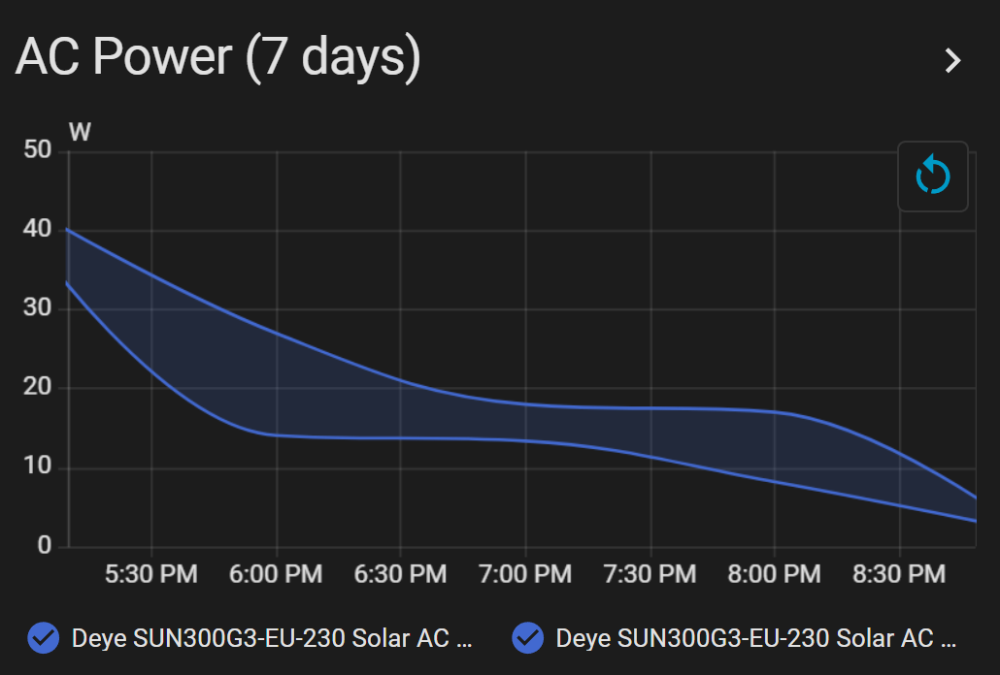
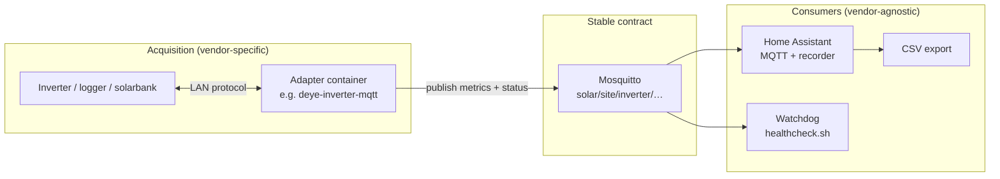

<div align="center">

[](https://henba1.github.io/bkw_tracker/)

</div>

# Deye solar inverter monitoring

<p align="center">
  <a href="https://henba1.github.io/bkw_tracker/">
    
  </a>
</p>



Reads power and energy from a **Deye micro-inverter** (tested on SUN300G3), publishes a live **MQTT** stream, and surfaces it in **Home Assistant** with dashboards and CSV export.

Runs on a small always-on Linux host with Docker (e.g. Raspberry Pi).

---

## Features

### Data acquisition (MQTT, ~30 s)

Published under `solar/<site>/<inverter_id>/` (default `solar/home/sun300g3`):

| Stream | Topic suffix | Unit |
|---|---|---|
| AC output power | `ac/active_power` | W |
| PV / DC power | `dc/pv1/power` | W |
| Energy today | `day_energy` | kWh |
| Lifetime energy | `total_energy` | kWh |
| Grid voltage | `ac/l1/voltage` | V |
| Grid frequency | `ac/freq` | Hz |
| Inverter temperature | `radiator_temp` | °C |
| Bridge online (LWT) | `status` | online / offline |
| Logger online | `logger_status` | online / offline |

Authenticated **Mosquitto** broker; `deye-bridge` polls the inverter logger on the LAN.

### Home Assistant

- MQTT sensors with correct `device_class` / `state_class` (Energy Dashboard–ready)
- Device grouping under one inverter device
- `unavailable` when logger drops (`logger_status` + 120 s `expire_after`)
- One-command install into an existing `homeassistant` Docker container
- **Solar** Lovelace dashboard: live gauge, entity cards, 48 h power history, 30-day daily energy bars, 7-day power statistics
- **Energy Dashboard** support via lifetime energy sensor (`total_increasing`)

### Export & history

- **CSV export** button — dumps all recorder time-series for solar entities to `/config/exports/`
- **Open History** — HA history view for all solar streams
- Long-term statistics via HA recorder (graphs on the dashboard)

### Operations

- Interactive `./setup.sh` wizard (`stack.env` IaC)
- `./scripts/stack.sh` — render configs, up/down, verify broker & metrics
- Optional **watchdog cron** — restarts bridge if MQTT goes silent during daylight
- Docker `restart: unless-stopped` on broker and bridge

### Optional diagnostics (git clone / dev)

- `uv` + `pysolarmanv5` — network scan, Solarman smoke read (not in release tarball)

---

## Prerequisites

| Requirement | Details |
|---|---|
| **Host** | Linux with Docker and Docker Compose v2 |
| **Python** (optional) | 3.11+ with [uv](https://docs.astral.sh/uv/) — discovery/smoke tools only |
| **Network** | Host on the same LAN as the inverter |
| **Inverter** | Joined to your home Wi-Fi (not only its AP hotspot) |
| **Daylight** | First inverter test needs sun — the built-in Wi-Fi module is solar-powered |
| **Home Assistant** | Optional but this repo targets it — see below |

### Home Assistant

Works with an **existing Home Assistant Docker container** (recommended on the same Pi):

- Container name defaults to `homeassistant` (`HA_CONTAINER` in `stack.env`)
- Config path is auto-detected from the container’s `/config` mount
- If HA uses **host networking** on the same machine as Mosquitto → broker is `127.0.0.1:1883` (default)
- If HA runs elsewhere → set `HA_CONFIG` to its config directory and `MQTT_BROKER_HOST` to this Pi’s LAN IP

This project runs **Mosquitto + deye-bridge** only — it does not install Home Assistant.

### Inverter (SUN300G3 defaults)

`stack.env.example` ships working defaults for SUN300G3 (`LOGGER_PROTOCOL=at`, `LOGGER_PORT=48899`). You still need:

- **Logger IP** — from your router’s device list (reserve a static DHCP lease)
- **Logger serial** — 10-digit sticker on the unit (often `41…`)

---

## Quick start

```bash
./setup.sh
```

The wizard asks for an MQTT password, inverter IP (skippable), and logger serial. It writes `stack.env`, starts Mosquitto, and optionally starts data collection.

```bash
./scripts/stack.sh up
./scripts/stack.sh verify-metrics   # needs daylight + logger online
```

---

## Home Assistant

```bash
./scripts/install_ha_package.sh --restart
```

Then: **Settings → Dashboards → Energy** → add `sensor.deye_sun300g3_eu_230_solar_total_energy`.

Sidebar **Solar** dashboard: live power, daily energy, history graphs, **Export all solar data** (CSV).

---

## Using a different inverter

| Change | Effort |
|---|---|
| **Another Deye model** | Edit `stack.env` (`LOGGER_*`, `HA_INVERTER_*`, `DEYE_METRIC_GROUPS`) → `./scripts/stack.sh render && ./scripts/stack.sh up` |
| **Different brand / solarbank** | Replace `deye-bridge` in `compose.yml` with that vendor’s MQTT adapter; align MQTT topics (or add a remap layer); re-render HA package |

The stack is built around a **stable MQTT contract** between acquisition and Home Assistant. Mosquitto, HA, export, and the watchdog stay the same; only the acquisition layer (and topic names if needed) change. Full interchangeability notes, canonical topic schema, and system diagram: [`docs/SCHEMA.md`](docs/SCHEMA.md) *(maintainer / integrator doc)*.

---

## Commands

| Task | Command |
|---|---|
| Start stack | `./scripts/stack.sh up` |
| Stop stack | `./scripts/stack.sh down` |
| Service status | `./scripts/stack.sh ps` |
| Live MQTT traffic | `./scripts/stack.sh verify-broker` |
| Check metrics | `./scripts/stack.sh verify-metrics` |
| Install / update HA | `./scripts/install_ha_package.sh --restart` |
| Watchdog cron (optional) | `./scripts/install_healthcheck_cron.sh` |

Manual config: copy `stack.env.example` → `stack.env`, then `./scripts/stack.sh init`.

---

## Troubleshooting

**Inverter unreachable** — wait for daylight; confirm IP in router; run `./setup.sh --add-inverter`.

**HA shows no data** — run `./scripts/stack.sh up`; re-run `./scripts/install_ha_package.sh --restart`; check logger (`docker logs deye-bridge --tail 20`).

**Wrong serial** — edit `LOGGER_SERIAL` in `stack.env`, then `./scripts/stack.sh render && ./scripts/stack.sh up`.

**Export CSV** — after using the dashboard button: `docker cp homeassistant:/config/exports/ ./`

**Start over**

```bash
./scripts/stack.sh down
rm -f stack.env deye-bridge/config.env mosquitto/config/passwd
sudo rm -rf mosquitto/data
./setup.sh
```
